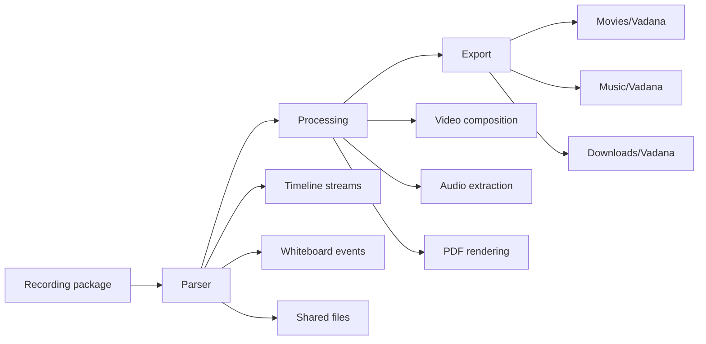

# Vadana Extractor


Vadana Extractor is an Android application for extracting and organizing online class recordings from Vadana virtual classrooms.

The project helps solve practical limitations of the original platform:

- Recordings do not always provide a direct download option.
- The built-in playback experience is limited for reviewing long classes.
- Long recordings may contain inactive time, waiting periods, or unused sections that are easier to review after exporting the useful media.

Vadana Extractor lets users keep offline copies of their classes, convert recordings into useful formats, and access generated files through Android public storage.

## Features

- **Recording package extraction**: downloads Vadana / Adobe Connect recording packages from recording links, including links that contain session tokens.
- **Video generation**: builds synchronized MP4 output from screen-share, shared PDF, whiteboard, pointer, and audio timeline data when those streams are present.
- **Audio extraction**: extracts and merges available `cameraVoip*.flv` audio into M4A output.
- **Whiteboard PDF export**: reconstructs whiteboard pages and exports them as a PDF, with matching shared PDFs used as page backgrounds when available.
- **Shared file export**: downloads classroom shared files and publishes them with safe file names.
- **Background processing**: runs long extraction jobs through WorkManager foreground work with a cancellable notification.
- **Progress tracking**: reports analysis, download, export, audio, PDF, and video processing progress in the app and notification.

## Screenshots

> Screenshots are not included in this repository yet. Add current app screenshots here when preparing a public release.

| Home / Recording Input | Output Selection | Processing Progress |
| --- | --- | --- |
| _Placeholder_ | _Placeholder_ | _Placeholder_ |

## Technology Stack

- **Kotlin** for Android application code.
- **Jetpack Compose** for declarative UI.
- **Material 3** for application components and theming.
- **WorkManager** for foreground background processing, progress updates, and cancellation.
- **OkHttp** for recording package and shared-file downloads.
- **FFmpeg / FFmpegKit-compatible Android package** for audio extraction, audio merging, and video encoding workflows.
- **Android Media APIs** including `MediaMuxer`, `MediaCodec`, `MediaMetadataRetriever`, `MediaStore`, and PDF rendering APIs where appropriate.
- **Storage approach**:
  - Private app storage for cached recording packages and encrypted worker request data.
  - Temporary cache storage for active processing work directories.
  - Android `MediaStore` public collections for exported videos, audio files, PDFs, and shared files.

## Requirements

- Android Studio with Android Gradle Plugin support for this project.
- Android 10 or later.
- Minimum SDK: **29**.
- Target SDK: **35**.
- JDK: **17**.
- Supported native architecture: **arm64-v8a**.
- Network access to download Gradle dependencies and class recording content.

## Installation

### Clone the project

```bash
git clone <repository-url>
cd vadana-extractor
```

### Open in Android Studio

1. Open the repository folder in Android Studio.
2. Let Gradle Sync finish.
3. Select an Android 10+ physical device or emulator.
4. Run the `app` configuration.

### Build a debug APK

```bash
./gradlew assembleDebug
```

Debug APK output is generated under `app/build/outputs/apk/debug/`.

### Build a release APK

```bash
./gradlew assembleRelease
```

Release builds enable code shrinking through the configured Android release build type. Configure signing outside this repository before distributing release artifacts.

## Usage Guide

1. **Enter recording information**  
   Paste the full Vadana recording link. Private recordings should include the `session=` value in the link when required by the server.

2. **Analyze recording**  
   Tap the analysis action to download or reuse the recording package and inspect available streams, whiteboard pages, audio, shared PDFs, and classroom files.

3. **Select outputs**  
   Choose the available outputs for the analyzed recording: synchronized video, audio-only export, whiteboard PDF, and/or shared classroom files.

4. **Start extraction**  
   Start the extraction job. Processing continues as foreground WorkManager work and can be cancelled from the notification.

5. **Access generated files**  
   Exported files are published through Android `MediaStore` and appear in public media/download locations depending on file type.

## Output Files

- **Video output**: synchronized MP4 files are exported to `Movies/Vadana`.
- **Audio output**: M4A audio files are exported to `Music/Vadana`.
- **PDF output**: reconstructed whiteboard PDFs are exported to `Downloads/Vadana`.
- **Shared files**: classroom shared files are exported to `Downloads/Vadana` using their detected MIME types when possible.

## Architecture Overview

The application keeps responsibilities separated across focused layers:

- **UI layer**: Compose screens, app theme, state management, user input, output selection, and work progress display.
- **Worker layer**: foreground WorkManager jobs that coordinate package analysis, downloads, media generation, export, progress updates, cancellation, and cleanup.
- **Data layer**: recording URL parsing, Vadana / Adobe Connect HTTP access, package archive reading, stream parsing, timeline parsing, and whiteboard parsing.
- **Media processing layer**: FFmpeg-backed audio workflows and synchronized video composition.
- **Storage layer**: encrypted worker request storage, temporary processing directories, and public output publishing through `MediaStore`.

## Media Pipeline




